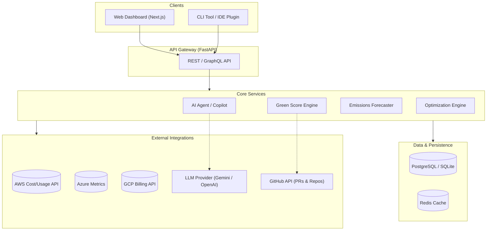
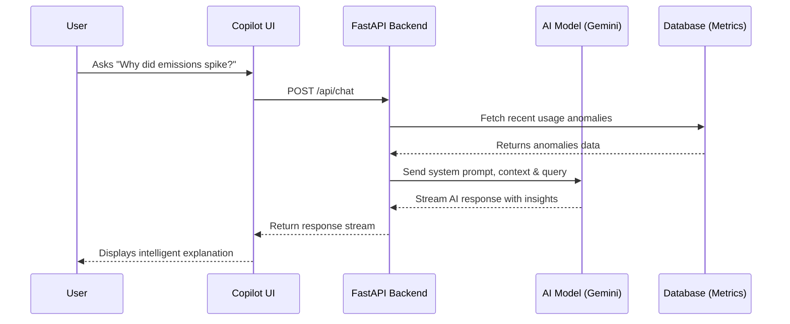
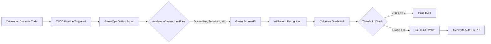
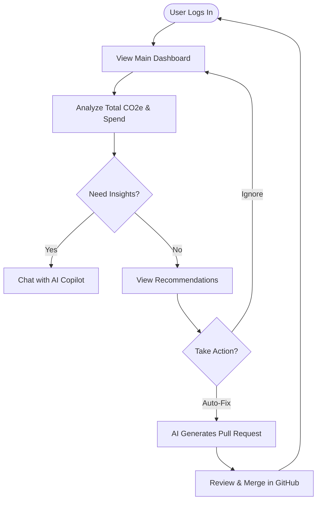
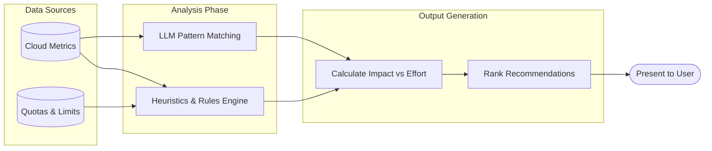
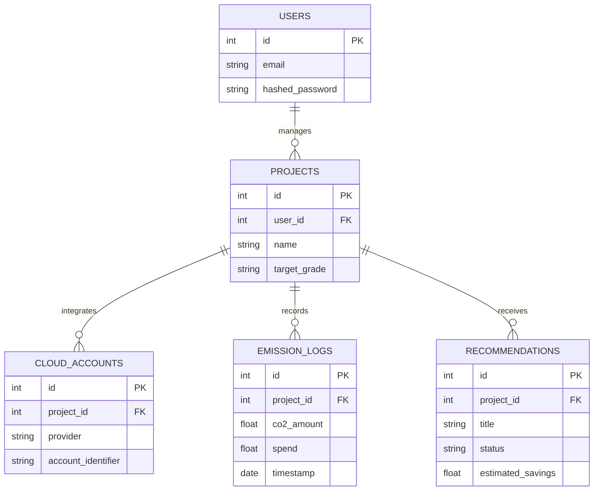
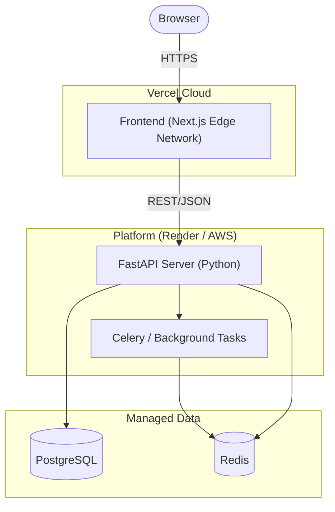
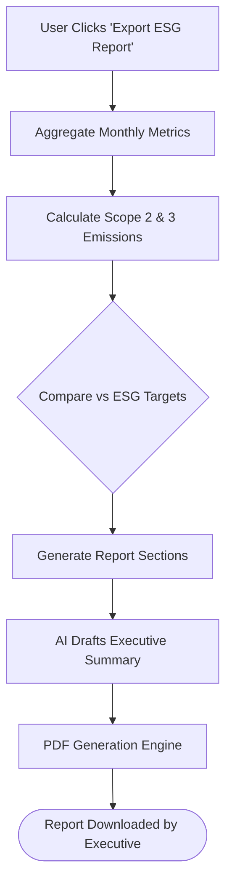

# GreenOps AI Copilot - Architecture Diagrams

This document contains 10 professional Mermaid diagrams detailing the architecture, workflows, and pipelines of the GreenOps AI Copilot platform. These diagrams can be directly embedded into your GitHub README or technical documentation.

## 1. High-Level System Architecture


## 2. Data Flow Architecture
```mermaid
flowchart LR
    A[Cloud Providers (AWS, Azure, GCP)] -->|Usage & Billing Data| B(Data Ingestion Pipeline)
    B --> C{Data Normalization}
    C -->|Normalized Metrics| D[(Time-Series DB)]
    D --> E[Carbon Calculation Engine]
    E -->|CO2e Metrics| F[(Operational DB)]
    F --> G[Forecasting Model]
    F --> H[Recommendation Engine]
    G --> I[Dashboard & Reporting]
    H --> I
    I --> J((End User))
```

## 3. AI Agent Workflow


## 4. Shift-Left Green Score Pipeline


## 5. User Journey Flowchart


## 6. Carbon Forecasting Pipeline
```mermaid
graph TD
    A[Historical Usage Data] --> B[Data Preprocessing & Cleaning]
    B --> C[Feature Engineering (Seasonality, Spikes)]
    C --> D{Forecasting Engine}
    D -->|Prophet / Time-Series| E[Baseline Projection]
    D -->|LLM Anomaly Detection| F[Event-based Projection]
    E --> G[Combine Forecasts]
    F --> G
    G --> H[Calculate Confidence Intervals]
    H --> I[Store Forecast Data]
    I --> J[Render Predictive Charts]
```

## 7. Recommendation Engine Workflow


## 8. Database ER Diagram


## 9. Deployment Architecture


## 10. Executive ESG Report Generation Flow

